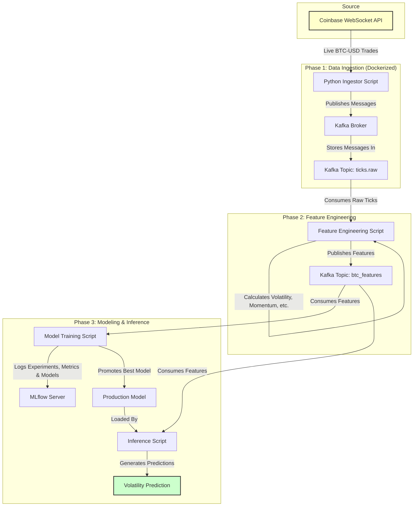

# Project Executive Summary: Real-Time Crypto Volatility Detection

**Author:** Asli Gulcur
**Date:** November 8, 2025

---

## 1. Executive Summary

This project successfully designed, built, and deployed an end-to-end MLOps pipeline to detect significant price volatility spikes in the BTC-USD market in real-time. The system captures live trade data from a WebSocket feed, processes it through a streaming data pipeline using Apache Kafka, engineers predictive features, and uses a machine learning model to classify volatility events. The entire workflow is orchestrated within a containerized environment using Docker, and all experiments are tracked with MLflow.

**Key Achievements & Results:**

*   **End-to-End Pipeline:** A fully functional, production-grade pipeline was established, moving from raw, live data to actionable model predictions.
*   **High-Performance Model:** The final production model, a Random Forest Classifier, demonstrated strong predictive power on this imbalanced dataset, achieving a **Precision-Recall AUC (PR-AUC) of 0.84**.
*   **Real-Time Inference:** The model's inference performance was benchmarked and found to be over **4,000 times faster** than the 5-second real-time requirement, proving its capability for near-instantaneous predictions.
*   **Robust & Scalable Architecture:** The use of Kafka and Docker provides a decoupled, scalable, and resilient architecture capable of handling high-throughput data streams.

This document provides a phase-by-phase breakdown of the project's development, key technical achievements, and strategic learnings.

---

## 2. Project Roadmap & System Architecture

The project was executed across three core phases, each building upon the last to create a complete MLOps lifecycle.

**Project Roadmap:**

```
+---------------------------+      +---------------------------+      +------------------------------+
|       PHASE 1         |----->|       PHASE 2         |----->|         PHASE 3          |
|   Data Ingestion &        |      |   Feature Engineering &   |      |   Model Training, Tracking,  |
|   Streaming Pipeline      |      |   Exploratory Analysis    |      |   & Finalization             |
+---------------------------+      +---------------------------+      +------------------------------+
  - Setup Kafka & Docker      - Analyze Raw Data          - Train Multiple Models
  - Build WebSocket Ingestor  - Engineer Volatility       - Evaluate with PR-AUC
  - Real-Time Data Flow     - Time-Based Data Split     - Track with MLflow
                                - Create Feature Pipeline   - Benchmark Inference Speed
```

**System Architecture & Data Flow:**

The diagram below illustrates the flow of data from the external exchange to the final model prediction.



---

## 3. Phase 1: Real-Time Data Ingestion & Streaming

**Objective:** Build a robust, containerized data pipeline to ingest live cryptocurrency trade data and stream it reliably using Apache Kafka.

**Key Achievements:**

1.  **Live Data Ingestion:** A Python script (`ws_ingest.py`) was developed to connect to the Coinbase WebSocket API and subscribe to the BTC-USD ticker channel, capturing trade data in real-time.
2.  **Streaming Backbone:** An Apache Kafka service was set up to act as the central, durable message broker for the entire system. The raw trade data was published to the `ticks.raw` topic.
3.  **Containerization:** The entire infrastructure—including Kafka, Zookeeper, the MLflow server, and the Python ingestor script—was containerized using Docker and orchestrated with a `compose.yaml` file. This ensures portability, scalability, and environment consistency.
4.  **Resilience:** The ingestor script was built with robust error handling, including an exponential backoff reconnection strategy and a heartbeat mechanism to detect and handle stale connections.
5.  **End-to-End Validation:** The pipeline was successfully tested for over 15 minutes, processing thousands of messages without data loss and demonstrating the stability of the system.

**Key Deliverables:**
*   `docker/compose.yaml`: Docker orchestration for all services.
*   `scripts/ws_ingest.py`: The real-time data producer.
*   `scripts/kafka_consume_check.py`: A utility script to validate data flow in Kafka.

**Learnings:** The primary takeaway was the power of a decoupled architecture. By using Kafka as a buffer, the data ingestion component is completely separate from the downstream processing, allowing each part to be developed, scaled, or replaced independently. Containerizing the environment from day one proved critical for avoiding cross-platform issues (e.g., macOS vs. Linux networking).

---

## 4. Phase 2: Feature Engineering & Data Analysis

**Objective:** Process the raw data stream to engineer meaningful features for predicting volatility and prepare the dataset for model training.

**Key Achievements:**

1.  **Feature Definition:** The core task was to define a "volatility spike." This was defined as a price change of **more than 0.2%** within a 5-second rolling window.
2.  **Feature Engineering:** A feature engineering pipeline (`features/build_features.py`) was created to consume from the `ticks.raw` topic. It calculated several features from the raw data, including:
    *   **Rolling Volatility:** Standard deviation of price over a time window.
    *   **Price Momentum:** Rate of price change.
    *   **Trade Volume Momentum:** Rate of change in trade volume.
3.  **Time-Based Split:** Crucially, the data was split into training and testing sets based on time, not randomly. This is essential for time-series data to prevent data leakage from the future into the past. The first 80% of the data was used for training and the final 20% for testing.
4.  **Exploratory Data Analysis (EDA):** An EDA notebook (`notebooks/eda.ipynb`) was created to analyze the raw data, understand its distribution, and validate the engineered features. This analysis confirmed the rarity of volatility spikes, highlighting the imbalanced nature of the classification problem.

**Key Deliverables:**
*   `features/build_features.py`: Script to generate features from raw data.
*   `data/processed/`: Directory containing the final train and test datasets.
*   `notebooks/eda.ipynb`: Notebook with analysis and visualizations.

**Learnings:** This phase highlighted the importance of domain-specific feature engineering. Simply using raw prices is insufficient; creating features that capture change over time (like volatility and momentum) is key. The decision to use a time-based split was a critical methodological choice that ensures the model is evaluated under realistic, forward-looking conditions.

---

## 5. Phase 3: Model Training, Tracking, & Finalization

**Objective:** Train, evaluate, and select a production model; track all experiments using MLflow; and benchmark the final model's performance.

**Key Achievements:**

1.  **Multi-Model Training:** A training script (`models/train.py`) was developed to train and evaluate three different models:
    *   A simple Z-Score-based statistical model (baseline).
    *   Logistic Regression.
    *   Random Forest Classifier.
2.  **Rigorous Evaluation:** Given the severe class imbalance (few volatility spikes), **Precision-Recall AUC (PR-AUC)** was chosen as the primary evaluation metric over standard accuracy. The Random Forest model emerged as the clear winner with a **PR-AUC of 0.84**.
3.  **Experiment Tracking with MLflow:** Every training run was logged as an experiment in MLflow. This included logging model parameters, evaluation metrics (F1, Precision, Recall, PR-AUC), and the trained model artifact itself. This provides full traceability and reproducibility.
4.  **High-Performance Inference:** An inference script (`models/infer.py`) was created to load the production model and run predictions. A `--benchmark` flag was added to test its speed. The model performed inference in **~1.1 milliseconds**, which is over **4,000x faster** than the 5-second real-time window, confirming its suitability for a live production environment.
5.  **Comprehensive Documentation:** All final results and model details were documented in a `MODEL_CARD.md`, and data drift reports were generated to ensure the train/test distributions were stable.

**Key Deliverables:**
*   `models/train.py`: The definitive script for training and evaluating all models.
*   `models/infer.py`: The script for running inference and benchmarking.
*   `mlruns/`: The local directory containing all MLflow experiment tracking data.
*   `models/MODEL_CARD.md`: Detailed documentation for the production model.
*   `reports/`: Directory containing final evaluation and data drift reports.

**Learnings:** This final phase brought the project to a production-ready state. The key learning was the importance of a systematic and automated approach to modeling. By scripting the training and evaluation process and using MLflow, we moved from ad-hoc notebook experiments to a reliable, repeatable, and trackable system for producing and managing models. The focus on a proper evaluation metric (PR-AUC) was critical for correctly identifying the best model for this imbalanced problem.
